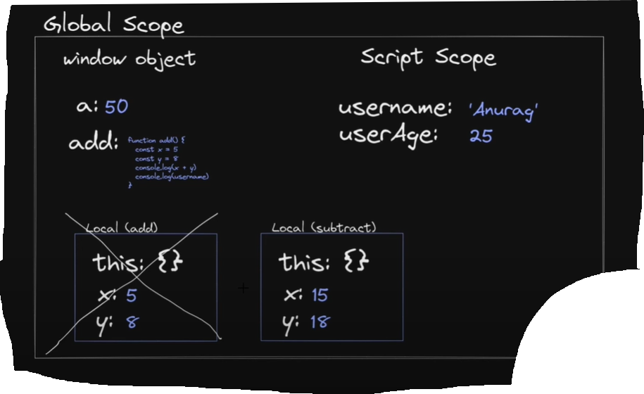

# Scope in JavaScript (Detailed Explanation)

**Scope** in JavaScript refers to the current context of execution, which determines the accessibility and visibility of variables and functions. JavaScript has the following types of scope:

## 1. Global Scope

Variables declared outside of any function or block are in the **global scope** and can be accessed from anywhere in the code.

```js
let globalVar = "I am global";

function showVar() {
  console.log(globalVar);  // Accessible here
}
showVar();  // Output: I am global
```

### Key Points:
- Variables in the global scope can be accessed throughout the program.
- Be cautious with global variables to avoid conflicts.

## 2. Function Scope (Local Scope)

Variables declared within a function are in **function scope**, also called **local scope**. They can only be accessed inside the function.

```js
function localScope() {
  let localVar = "I am local";
  console.log(localVar);  // Accessible here
}
localScope();
console.log(localVar);  // Error: localVar is not defined
```

### Key Points:
- Variables defined inside a function are not accessible outside the function.

## 3. Block Scope

Variables declared using `let` and `const` inside blocks (`{}`) have **block scope**, meaning they are only accessible within that block.

```js
{
  let blockScopedVar = "I am block-scoped";
  console.log(blockScopedVar);  // Accessible here
}
console.log(blockScopedVar);  // Error: blockScopedVar is not defined
```

### Key Points:
- Block scope applies to variables declared with `let` and `const`.
- Variables declared with `var` are **not block-scoped**; they are function-scoped.

## 4. Lexical Scope (Static Scope)

Lexical scope refers to how the JavaScript engine determines variable scope based on where functions and variables are physically written in the code. A function’s inner scope can access variables from its outer scope.

```js
function outer() {
  let outerVar = "Outer";

  function inner() {
    console.log(outerVar);  // Accessible here
  }
  inner();  // Output: Outer
}
outer();
```

### Key Points:
- Inner functions can access variables defined in their outer functions, but not the other way around.

## 5. Closures

A **closure** is when an inner function has access to the variables of its outer function, even after the outer function has returned.

```js
function outerFunc() {
  let count = 0;

  return function increment() {
    count++;
    console.log(count);
  };
}

let counter = outerFunc();
counter();  // Output: 1
counter();  // Output: 2
```

### Key Points:
- Closures preserve access to the outer scope, even after the outer function has executed.

## 6. Window Scope

In JavaScript, the **window scope** refers to the global scope within a web browser environment. It represents the global object, which is accessible throughout the entire web page.

```js
console.log(window.innerWidth);  // Accessing window property
window.alert("Hello, world!");  // Calling window method
```

### Key Points:
- The window object contains properties and methods that can be accessed globally.
- Variables declared without the `var`, `let`, or `const` keywords are automatically assigned to the window object.

## Summary

- **Global Scope**: Accessible throughout the program.
- **Function Scope**: Local to functions.
- **Block Scope**: Local to blocks (`let` and `const`).
- **Lexical Scope**: Inner functions can access outer variables.
- **Closures**: Functions remember their outer variables.
- **Window Scope**: Global scope within a web browser environment.

### reference image



For more information about Scope in JavaScript, visit: 
> - [W3School](https://www.w3schools.com/js/js_scope.asp)
> - [YouTube](https://www.youtube.com/watch?v=7QhMQRRBpZ0&list=PLfEr2kn3s-br9ZFmejfLhAgMbGgbpdof8&index=74)


