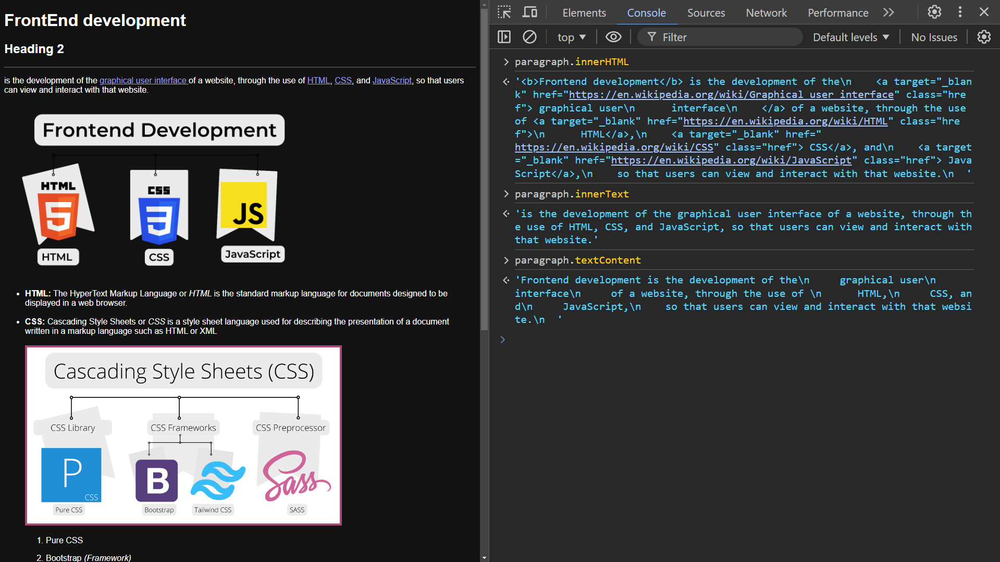

#  Here’s a quick breakdown of the difference between `innerText`, `innerHTML`, and `textContent`:

## 1. **`innerText`**:
   - Represents the **visible text** inside an element, as it's rendered on the page.
   - It respects **CSS styling** (e.g., if `display: none` is set, it won't include that text).
   - It also **triggers reflows** to calculate the visible text, making it slower compared to `textContent`.

   ```javascript
   const element = document.getElementById("example");
   console.log(element.innerText);
   ```

## 2. **`innerHTML`**:
   - Contains the **HTML markup** of an element, including any child elements.
   - It returns a string of **HTML content**.
   - Can be used to set new HTML content inside an element, but this can introduce security risks (e.g., XSS attacks) if not handled properly.

   ```javascript
   const element = document.getElementById("example");
   console.log(element.innerHTML);
   ```

## 3. **`textContent`**:
   - Represents the **raw text** inside an element, including the content of all child elements, without considering CSS or formatting.
   - It **ignores hidden text** (like `display: none`) and returns everything.
   - It’s generally faster than `innerText` since it doesn’t account for layout or styling.

   ```javascript
   const element = document.getElementById("example");
   console.log(element.textContent);
   ```



### Key Differences:
- **`innerText`**: Only the visible text, slower due to layout recalculations.
- **`innerHTML`**: Contains HTML, can modify structure/content (risky if not sanitized).
- **`textContent`**: Raw text, faster, ignores CSS styles like `display: none`.

## reference
to know more about innerText, innerHTML, textContent... visit:
> - [freeCodeCamp](https://www.freecodecamp.org/news/innerhtml-vs-innertext-vs-textcontent/)
> - [YouTube](https://www.youtube.com/watch?v=83u35YfNE1w&list=PLfEr2kn3s-br9ZFmejfLhAgMbGgbpdof8&index=94&pp=iAQB)

